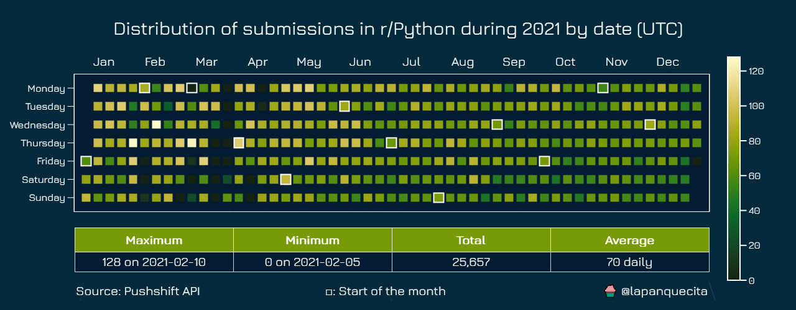
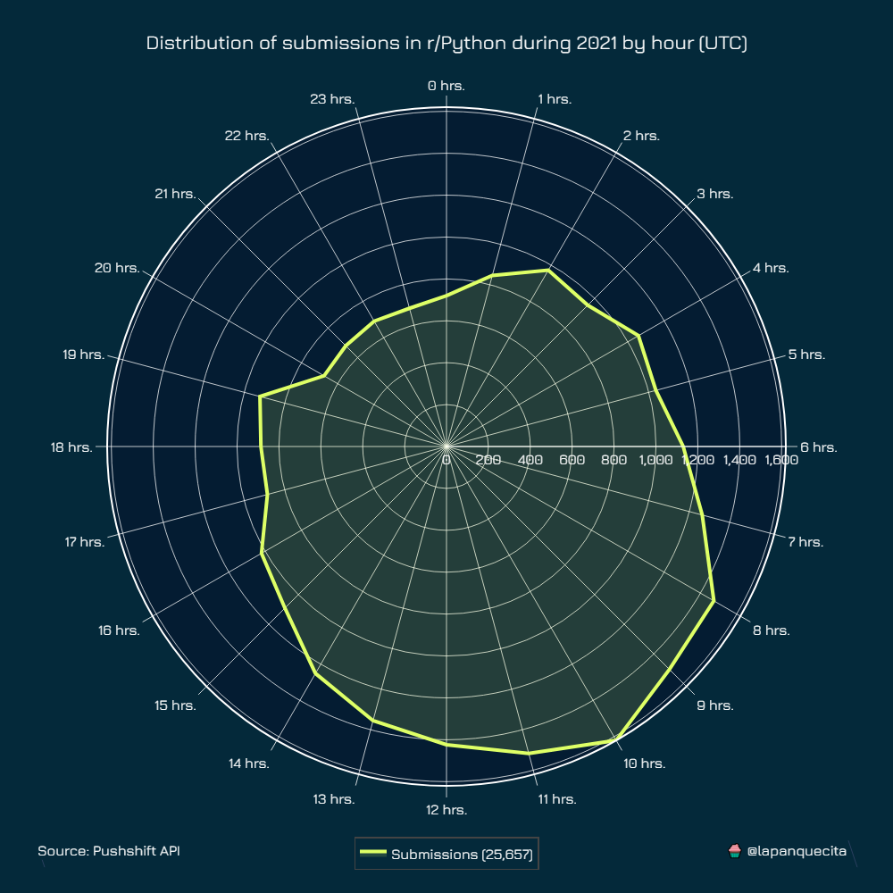
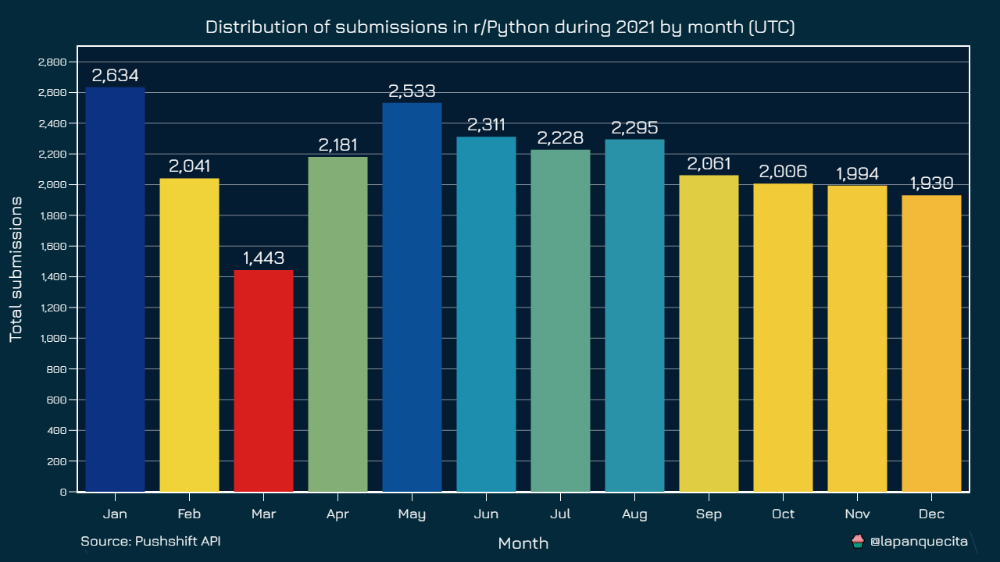
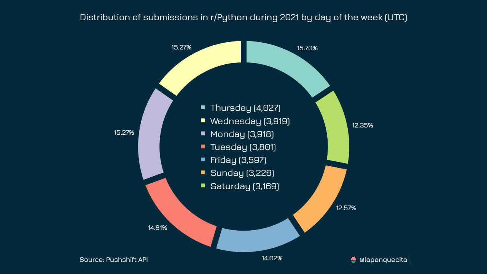

# Reddit Analyzer

This repository contains a couple of scripts that will help you download Reddit data from public subreddits you are interested in using PushShift API.

The first step is to installing the dependencies, then configure `scraper.py` with the target subreddit and the year.

*For installing dependencies :*

```bash
# for installing dependencies
$ python -m pip install -r requirements.txt
```

*For configuring scraper.py :*

```bash
$ python scrapper.py -r subreddit_name -yr required_year
```

`
Note:  
The default value of the subreddit name is set to r/python and the year to the current year.
`

*Note: You can download data from a larger time span if you wish. You will only need to manually adjust the epochs in the scrapper.py file.*

After you have downloaded the data you will have a new CSV file ready to be analyzed.

The next step is to run `plotter.py` with the subreddit name and with the same year you passed in the `scrapper.py` (for the calendar plot).

*using the command below :*

```bash
$ python plotter.py -r subreddit_name -yr required_year
```

____
`All plots are fully documented, you can see them below.`
____

## Example using data collected from r/python subreddit for the year 2021

***commands used :***

```bash
# for help on the scripts run
# $ python script_name.py --help

$ python scrapper.py -r Python -yr 2021
$ python plotter.py -r Python -yr 2021
```

### **Distribution by date**



### **Distribution by hour**



### **Distribution by month**



### **Distribution by day of the week**


