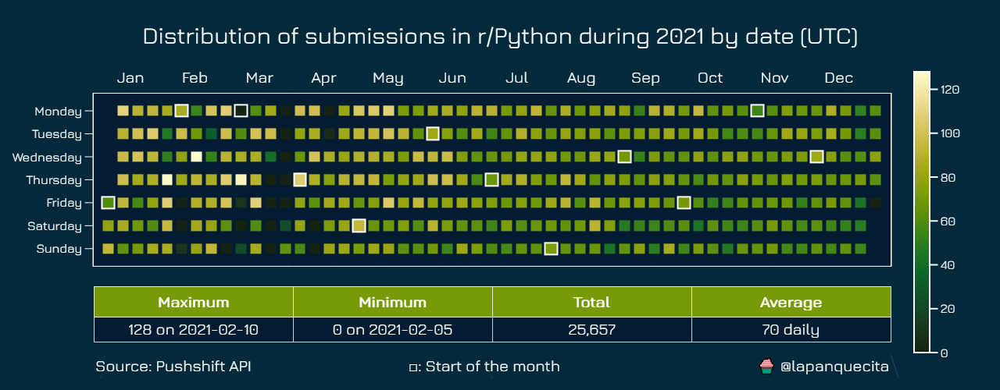
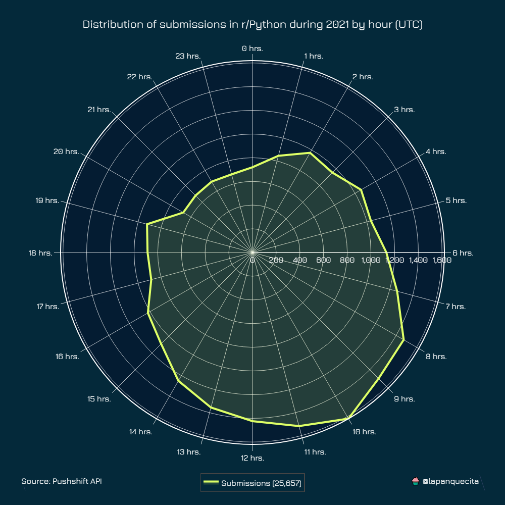
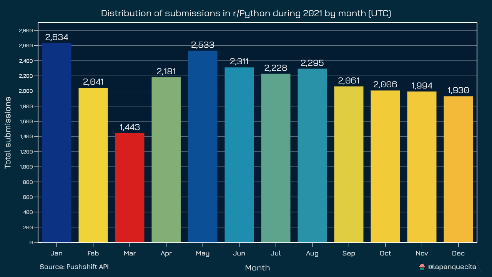

# Reddit Analyzer

This repository contains a couple of scripts that will help you download Reddit data from public subreddits you are interested in.

The first step is to configure `scraper.py` with the target subreddit and the year.

*Note: You can download data from a larger time span if you wish. You will only need to manually adjust the epochs.*

After you have downloaded the data you will have a new CSV file ready to be analyzed.

The next step is to configure `plotter.py` with your CSV file name and the year you want to plot (for the calendar plot).

All plots are fully documented, you can see them below.

## Distribution by day of the year

## Distribution by hour

## Distribution by month

## Distribution by day of the week

